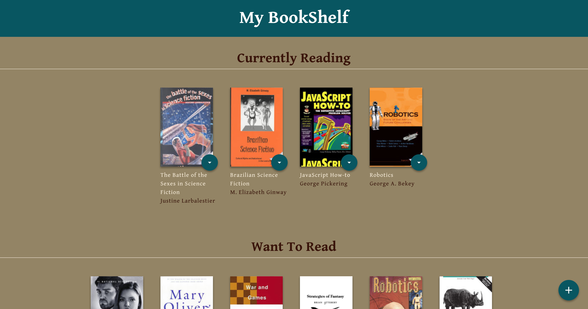

# My Bookshelf App
##### Project from the *Front-End Web Developer Nanodegree* at Udacity

#### Introduction

**Title**: My Bookshelf

by Steve Hanlon

*My Bookshelf* is a web app for storing books from an API and categorizing them on three shelves: *Currently Reading*, *Want to Read* and *Read*.  

Each book has a select menu allowing the user to move the book to a different shelf or remove it from the bookshelf entirely.

The lower right side of the screen shows a **+** icon linking to a Search interface.

The **Search** interface has a search input at top which is used to retrieve search results via an API call.  It then displays all books and their menus, which must show the correct shelf or "none" status (i.e. status matches the status shown in **My Bookshelf**)

[Click here to see the component and data break down of the app.](#picture-of-data-and-components-breakdown)

[Click here to see pictures of the website's Responsive Design.](#pictures-of-responsive-design)

##### Start-up Server

To run the server, NPM or Yarn must be installed.

Open up the terminal and go to the project directory.  Inside of the project directory, run:

`npm install`

`npm start`

If you have Yarn installed run:

`yarn start`

This project was built using *Create React App*.  For complete technical details click [Create React App](./docs/README.md)

##### Technical Components
- CSS Grid, Flexbox and Media Queries used to build the _responsive features_.
- JavaScript (ECMASript 6)
- React 16.5.2

##### Articles and Tutorials

Tutorials, articles and docs used while building this app.

- *Tutorial Request: FEND Project 6 - Walk Through (Short)* by Ryan Waite, [video](https://www.youtube.com/watch?v=N8bU1oWlLwY&feature=youtu.be)
- React Docs
    - [The Select Tab](https://reactjs.org/docs/forms.html#the-select-tag)
    - [Handling Events](https://reactjs.org/docs/handling-events.html)

#### Picture of Data and Components Breakdown

#### Pictures of Responsive Design
##### Phone

##### Tablet

##### Desk Top

### Future Features
-
